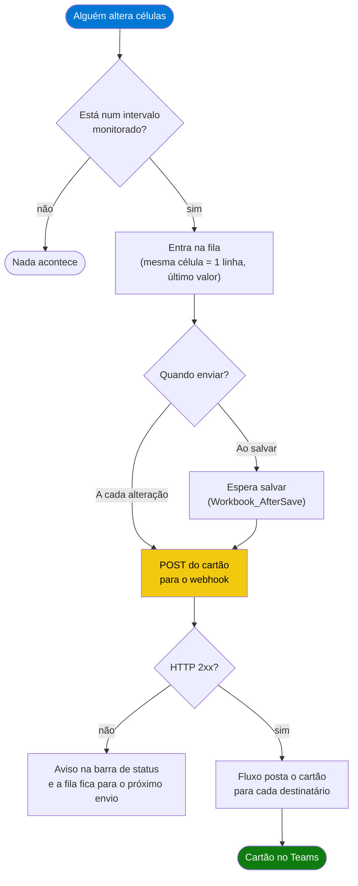

<div align="center">

# vba-webhooks

**Módulo VBA que avisa no Microsoft Teams quando alguém altera células monitoradas de uma planilha Excel, por um webhook do Power Automate.**


[](https://github.com/bsgustavo/vba-webhooks/actions/workflows/verificacoes.yml)

[](LICENSE)

</div>

---

## Visão Geral

Planilha compartilhada na rede costuma ter duas pontas: alguém preenche e outra pessoa precisa saber que foi preenchida. Sem aviso, quem acompanha tem que abrir o arquivo de tempos em tempos para conferir.

Este módulo resolve isso dentro da própria planilha. Quando alguém altera uma célula monitorada, ele monta um cartão adaptável com o que mudou e manda para um fluxo do Power Automate, que posta o cartão no Teams para cada destinatário. URL, destinatários, intervalos monitorados e o momento do envio ficam numa aba de configuração: ninguém precisa abrir o editor do VBA para ajustar.

> [!NOTE]
> O conector **Incoming Webhook** clássico do Teams (Office 365 Connectors) foi aposentado pela Microsoft. O substituto, usado aqui, é o gatilho **Quando uma solicitação de webhook do Teams é recebida** do Power Automate / Workflows.

## Funcionalidades

- **Só o que importa.** Monitora os intervalos que você listar (por aba ou em qualquer aba); o resto da planilha não dispara nada.
- **Dois momentos de envio.** `Ao salvar` manda um cartão por salvamento com tudo o que mudou. `A cada alteração` manda um cartão por edição. Colar um bloco conta como uma edição.
- **Cartão legível.** Cada célula aparece com o nome da coluna (`Status (Registros!E2)`) e o valor como está na tela, com datas e moedas formatadas. Célula editada duas vezes aparece uma vez, com o último valor. Bloco grande lista as 15 primeiras e diz quantas faltam.
- **Não atrapalha quem preenche.** Erro de rede não abre caixa de diálogo: o aviso vai para a barra de status e as alterações ficam na fila para o próximo envio.
- **Não dispara à toa.** Cópia aberta como somente leitura não envia, e fechar sem salvar não envia.
- **Configuração na planilha.** A macro `CriarConfiguracaoAlerta` monta a aba `Config_Alerta`; `OcultarConfiguracaoAlerta` esconde a aba de quem só preenche.

## Como Funciona



### Por que não há envio agendado

A primeira versão juntava as alterações e mandava depois de alguns segundos sem edição, com `Application.OnTime`. Nos testes, o cancelamento desse agendamento no `Workbook_BeforeClose` respondia sem erro, mas o agendamento disparava mesmo assim, e o **Excel reabria a planilha sozinho** depois de fechada. Por isso o módulo não usa timer. No modo `Ao salvar`, o envio fica no `Workbook_AfterSave`, que só roda quando o salvamento deu certo. Numa planilha da rede, esse também é o momento em que as alterações passam a existir para quem abre o arquivo.

## Pré-requisitos

| Requisito | Detalhe |
|---|---|
| Excel desktop para Windows | Microsoft 365 ou 2016+, pasta salva como `.xlsm` e macros habilitadas |
| Power Automate | conectores **Microsoft Teams** e **Controle**, ambos Standard (sem licença Premium) |
| Acesso à internet pelo WinHTTP | o envio usa `MSXML2.ServerXMLHTTP`, que segue o proxy do WinHTTP (`netsh winhttp show proxy`) |
| PowerShell 7 | só para gerar o exemplo e rodar os testes |

## Instalação

### 1. Crie o fluxo no Power Automate

| Passo | Configuração |
|---|---|
| Gatilho | **Microsoft Teams › Quando uma solicitação de webhook do Teams é recebida**. Em *Quem pode disparar o fluxo*, escolha **Qualquer pessoa**: o VBA manda o POST sem token. |
| Laço | **Controle › Aplicar a cada** em `triggerBody()?['destinatarios']` |
| Dentro do laço | **Microsoft Teams › Postar cartão em um chat ou canal**: postar como *Flow bot*, em *Chat com o Flow bot*. Destinatário: `items('Aplicar_a_cada')`. Cartão adaptável: `triggerBody()?['attachments']?[0]?['content']` |

Salve, ligue o fluxo e copie a URL do gatilho.

> [!WARNING]
> Não ponha um **Compor** com `createArray(...)` antes do laço. `destinatarios` já chega como lista, e o `createArray` embrulha numa lista de listas: o Teams recebe `["ana@empresa.com"]` como e-mail e o fluxo falha com `GraphUserDetailNotFound`.

### 2. Instale o módulo na planilha

1. Baixe [`src/AlertaTeams.bas`](src/AlertaTeams.bas) com **Download raw file** ou clonando o repositório. Não copie e cole o texto num arquivo novo: o editor do VBA importa Windows-1252, e um arquivo salvo em UTF-8 chega com os acentos quebrados.
2. Na planilha, `Alt+F11` › **Arquivo › Importar arquivo** › `AlertaTeams.bas`.
3. Dê duplo clique em **EstaPastaDeTrabalho** (*ThisWorkbook* no Excel em inglês) e cole o conteúdo de [`src/EstaPastaDeTrabalho.txt`](src/EstaPastaDeTrabalho.txt). Se a pasta já tiver esses eventos, só acrescente a linha `AlertaTeams.*` dentro deles.
4. `Alt+F8` › **CriarConfiguracaoAlerta** e preencha as células amarelas da aba `Config_Alerta`.
5. `Alt+F8` › **TestarAlertaTeams**: um cartão de teste deve chegar no Teams.
6. Salve como **Pasta de Trabalho Habilitada para Macro do Excel (`.xlsm`)**.
7. Opcional: `Alt+F8` › **OcultarConfiguracaoAlerta**.

Prefere começar de um arquivo pronto? A [release](https://github.com/bsgustavo/vba-webhooks/releases/latest) traz o `Alerta-Teams-Exemplo.xlsm`, com o módulo instalado, uma aba `Registros` monitorada em `A2:E500` e a configuração em branco. Para gerar o mesmo arquivo localmente: `pwsh -File .\scripts\Gerar-Exemplo.ps1`.

## Uso

Com a configuração pronta, quem preenche não faz nada diferente: edita e salva. No modo `Ao salvar`, cada salvamento com alteração monitorada manda um cartão como este:

> **Planilha alterada**
> Ana Souza (ana.souza) alterou 5 célula(s) em Controle.xlsm.
>
> **Arquivo:** \\\\servidor\\pasta\\Controle.xlsm · **Aba(s):** Registros · **Quando:** 01/10/2026 16:42
>
> **Células alteradas**
> Nº (Registros!A2): NC-0123 · Data (Registros!B2): 01/10/2026 · Setor (Registros!C2): Usinagem · Descrição (Registros!D2): Rebarba na peça · Status (Registros!E2): Aberta

A barra de status do Excel confirma o envio (`Alerta Teams enviado às 16:42 (5 célula(s)).`) ou avisa a falha.

Macros disponíveis em `Alt+F8`:

| Macro | O que faz |
|---|---|
| `CriarConfiguracaoAlerta` | cria a aba `Config_Alerta` (ou a mostra, se já existir) |
| `TestarAlertaTeams` | manda um cartão de teste e mostra o resultado |
| `MostrarConfiguracaoAlerta` / `OcultarConfiguracaoAlerta` | mostra ou esconde a aba de configuração |
| `EnviarPendentes` | envia a fila agora, sem esperar salvar |

## Configuração

Tudo na aba `Config_Alerta`. O código lê as células por nomes definidos, então inserir linhas na aba não quebra nada.

| Campo | Nome definido | Descrição | Padrão |
|---|---|---|---|
| Ativo | `AlertaAtivo` | `Sim` ou `Não`. Com `Não`, nada é enviado | `Sim` |
| URL do webhook | `AlertaURL` | URL do gatilho do fluxo | vazio |
| Título do alerta | `AlertaTitulo` | primeira linha do cartão | `Planilha alterada` |
| Quando enviar | `AlertaModo` | `Ao salvar` ou `A cada alteração` | `Ao salvar` |
| Máx. células listadas no cartão | `AlertaMaxCelulas` | as demais viram "e mais N célula(s)" | `15` |
| Linha do cabeçalho | `AlertaLinhaCabecalho` | linha com o nome das colunas; `0` desliga | `1` |
| Destinatários | `AlertaDestinatarios` | um e-mail por linha (aceita vários separados por `;`) | vazio |
| Aba / Intervalo | `AlertaIntervalos` | um intervalo por linha, ex. `Registros` / `B2:F500`. Aba vazia vale para qualquer aba; nenhuma linha preenchida monitora a pasta toda | vazio |

## Contrato do webhook

O POST tem `Content-Type: application/json; charset=utf-8` e corpo só em ASCII (acentos vão como `\uXXXX`):

```json
{
  "type": "message",
  "attachments": [
    {
      "contentType": "application/vnd.microsoft.card.adaptive",
      "content": {
        "$schema": "http://adaptivecards.io/schemas/adaptive-card.json",
        "type": "AdaptiveCard",
        "version": "1.4",
        "body": [
          { "type": "TextBlock", "text": "Planilha alterada", "weight": "Bolder", "size": "Medium", "color": "accent", "wrap": true },
          { "type": "TextBlock", "text": "Ana Souza (ana.souza) alterou 1 célula(s) em Controle.xlsm.", "wrap": true },
          { "type": "FactSet", "facts": [
            { "title": "Arquivo", "value": "\\\\servidor\\pasta\\Controle.xlsm" },
            { "title": "Aba(s)", "value": "Registros" },
            { "title": "Quando", "value": "01/10/2026 16:42" }
          ] },
          { "type": "TextBlock", "text": "Células alteradas", "weight": "Bolder", "spacing": "Medium", "wrap": true },
          { "type": "FactSet", "facts": [
            { "title": "Status (Registros!E2)", "value": "Aberta" }
          ] }
        ]
      }
    }
  ],
  "destinatarios": ["ana@empresa.com"]
}
```

`destinatarios` é sempre uma lista, mesmo com um e-mail só. O envelope `type` + `attachments` é o mesmo dos webhooks do Teams, então o cartão também serve para o modelo "Postar em um canal" do Workflows.

## Segurança

- **A URL do webhook é a credencial.** Quem tiver a URL consegue postar pelo fluxo. Ela fica na aba `Config_Alerta`: esconda a aba com `OcultarConfiguracaoAlerta` e, se quiser, proteja o projeto VBA com senha (**Ferramentas › Propriedades de VBAProject › Proteção**). Se a URL vazar, recrie o gatilho do fluxo para gerar outra.
- **Não versione pastas configuradas.** O `.gitignore` deste repositório bloqueia `*.xlsm`, e a CI recusa qualquer arquivo com URL assinada (`sig=...`).
- **Macros.** Cada pessoa precisa clicar em **Habilitar Conteúdo** na primeira vez. Para não depender disso, cadastre a pasta da rede como **Local Confiável** (Central de Confiabilidade, ou por GPO).

## Estrutura do projeto

```
vba-webhooks/
├── src/
│   ├── AlertaTeams.bas            # o módulo (Windows-1252 + CRLF, para importar no VBE)
│   └── EstaPastaDeTrabalho.txt    # eventos para colar no módulo da pasta
├── scripts/
│   └── Gerar-Exemplo.ps1          # gera o .xlsm de exemplo a partir de src/
├── tests/
│   ├── Executar-Testes.ps1        # Excel oculto + webhook falso local (32 verificações)
│   └── Verificar-Arquivos.ps1     # codificação do .bas e segredos (roda na CI)
├── .github/                       # CI e templates de issue e pull request
├── CHANGELOG.md
├── CONTRIBUTING.md
├── LICENSE
└── README.md
```

## Testes

```powershell
pwsh -File .\tests\Verificar-Arquivos.ps1    # sem Excel; é o que roda na CI
pwsh -File .\tests\Executar-Testes.ps1       # 32 verificações num Excel oculto
```

O `Executar-Testes.ps1` gera a pasta com o `Gerar-Exemplo.ps1` em `tests\tmp`, sobe um servidor HTTP em `127.0.0.1` que grava cada POST e responde `202`, e opera a planilha por automação. Os cenários cobrem:

- alteração fora do intervalo;
- os dois modos de envio;
- deduplicação e formatação de valores;
- aspas, acentos e quebras de linha no JSON;
- colar e apagar bloco;
- `Ativo = Não`;
- webhook fora do ar e reenvio;
- fechar sem salvar sem a pasta reabrir;
- cópia somente leitura.

Nenhum cartão sai para o Teams. Para incluir um envio real no fim, passe `-WebhookUrl <url> -Destinatario <email>`.

Importar código por automação exige a opção **Confiar no acesso ao modelo de objeto do projeto do VBA**. O `Gerar-Exemplo.ps1` liga essa opção só para o seu usuário enquanto roda e devolve o valor anterior no fim, mesmo se der erro. Os runners do GitHub não têm Excel, então a CI roda só o `Verificar-Arquivos.ps1`.

## Troubleshooting

| Sintoma | Causa | Ação |
|---|---|---|
| Barra de status: `Alerta Teams NÃO enviado (...)` | sem rede, URL errada ou proxy | rode `TestarAlertaTeams` para ver o erro; confira `netsh winhttp show proxy` |
| `TestarAlertaTeams` diz HTTP 202, mas o cartão não chega | o fluxo aceitou e falhou depois (fluxo desligado, destinatário inexistente) | veja o histórico de execuções do fluxo |
| Acentos quebrados no código (`não`) | o `.bas` foi salvo em UTF-8 | baixe de novo com **Download raw file** e importe |
| Nada acontece ao editar | macros desabilitadas, eventos não colados em `EstaPastaDeTrabalho`, `Ativo = Não`, intervalo que não cobre a célula, ou cópia somente leitura | confira nessa ordem; `TestarAlertaTeams` valida URL e destinatários |
| Um cartão por célula | modo `A cada alteração` | troque para `Ao salvar` |

## Limitações Conhecidas

- Só no Excel desktop para Windows. O Excel na Web não roda VBA, e o Excel para Mac não tem o `MSXML2`.
- Só alteração digitada, colada ou apagada dispara. Valor que muda por recálculo de fórmula não dispara.
- O envio é síncrono: leva cerca de meio segundo. Sem rede, segura o Excel por alguns segundos (2 s nos testes com a conexão recusada), limitado pelos timeouts curtos do `Postar`.
- A planilha precisa estar aberta por alguém. Para monitorar um prazo sem ninguém com o arquivo aberto, o caminho é um fluxo agendado lendo os dados, fora do escopo deste módulo.
- O cartão mostra o valor novo, não o anterior.

## Roadmap

- [ ] Valor anterior da célula no cartão
- [ ] Pacote do fluxo exportado (`.zip`) para importar direto no Power Automate

## Como contribuir

Issues e pull requests são bem-vindos. Veja o [CONTRIBUTING.md](CONTRIBUTING.md) para rodar os testes e conhecer a convenção de commits.

## Autor

Feito por **Gustavo Schmeier** · [github.com/bsgustavo](https://github.com/bsgustavo)

## Licença

[MIT](LICENSE). Microsoft, Excel, Teams e Power Automate são marcas da Microsoft Corporation.
